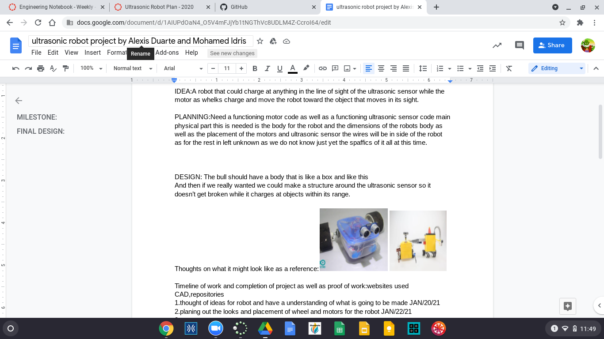
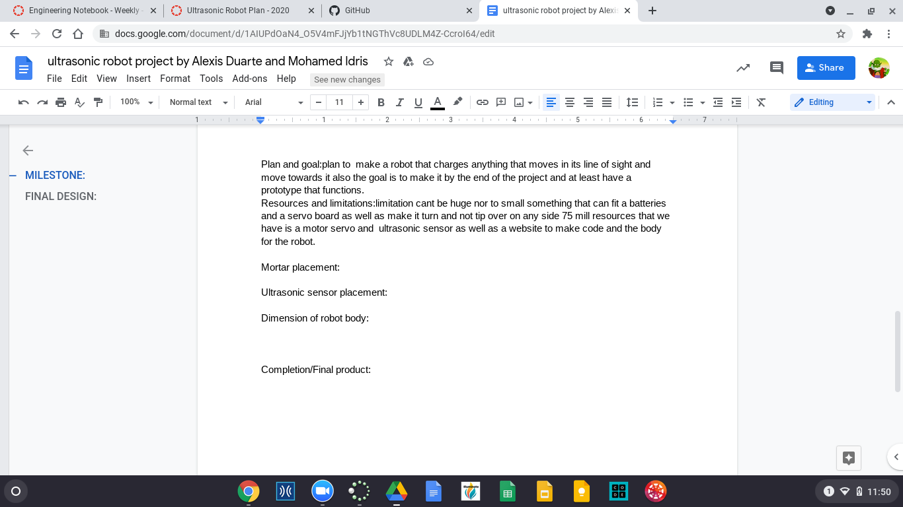

# ultrasonic Robot Plan
this week I worked with my partner Alex, and we decided to make a robotbull that charges at anything that comes in it's way.
that s our idea for this project. And it looks like Alex has a good understanding for it, so it should we doable for us. Anyways here are the images for our plan.
# Images

